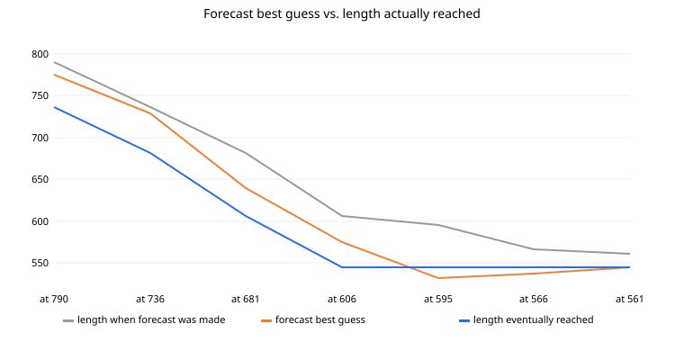
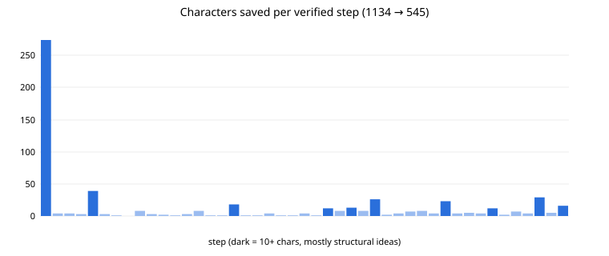

# Project journal

A chronological account of the TREE(3) golf, the discussions along the way, and what was
concluded. The earliest phases are summarised more briefly because only a summary of
that part of the conversation was available when this was written.

## 1. How it started: how big is TREE(3)?
The project grew out of questions about TREE(3) itself: how much space it would take to
store, the minimum mass/volume needed under the **Bekenstein bound**, and whether
compression helps. **Conclusion:** TREE(3) cannot be written out in any physical medium,
but a *program* that defines it is tiny. That led to the challenge: write the shortest
program that computes it.

## 2. Python golf (→ 348 characters)
- Albert asked for the shortest Python, then pushed for specific targets: 390, 354, 351, 350.
- Albert supplied variants, including `any(all(map(e,x[1:],p))for p in permutations(y[1:],len(x)-1))`,
  which ended up in the final version.
- Rejected along the way: `max(len(q),*[...])` (crashes on an empty list) and dropping the
  permutation length (wrong results).
- A helper to report the shortest character count of a code segment was written (`python/shortest_code.py`).
- **Conclusion:** 348 characters (plus newline) for a complete TREE(n) search in Python.

## 3. Assembly and the move to C
- Albert asked for a short assembly version: a readable C program compiled with `gcc -Os`
  (`c/tree.s`, about 1,411 bytes of machine code).
- Albert's own 1,525-character C version was reviewed, then a "shortest C" was requested.
- The first C golf (829 chars) used fixed caps. Albert rejected it: **"no we don't want a half
  ass version, it has to work."** **Conclusion:** no fixed limits, ever. The rebuilt
  1,144-char version uses only dynamic storage and was verified with sanitizers and
  thousands of reference comparisons. (Re-running it later confirmed the capped version
  stops at 6 for TREE(3).)

## 4. The verification harness
Every candidate from then on had to pass: AddressSanitizer + UBSan runs, TREE(1)=1,
TREE(2)=3, a 3,000-pair embedding cross-check against the Python reference, and a 286-tree
generator check. **Conclusion:** this harness is what made aggressive golf possible; it
caught every broken idea listed in `c/rejected/`.

## 5. Collaborative golf, 1,144 → 816
- Albert proposed many tricks, several of which worked (see the commit titles marked "Albert").
- **Argument-pointer access** (`(&x)[1]`) was asked about: rejected, because x86-64 passes
  arguments in registers, so it is undefined and unreliable.
- Hard-coding 3 colours (Albert) traded generality for about 30 chars: TREE(3) only from 816.

## 6. Undefined-behaviour debates
- `P[p][1]=p++`: genuinely unsequenced, and it segfaulted.
- A pasted analysis claimed `*P[p++]=1` was also undefined: **wrong** (`p` is read once).
- A pasted analysis said `f` falling off its end while its value is used is UB: **right**,
  fixed in the 761 version with `?:` (saving 1 instead of the proposed +2).
- `return!i<I` was proposed four times; it parses as `(!i)<I` and breaks TREE(2).
- **Conclusion:** claims about C semantics are settled by the C rules *and* by running the
  harness, not by confident prose.

## 7. Checking other AIs' claims
Several pasted analyses (apparently from other AI systems) were checked:
- "Corrected 598-char version, global `k`/`c` and `bzero` are bugs": the code was 795 chars
  and the bugs did not exist.
- A Python "translation" of the C program mislabelled the trees as permutations and printed 0
  (the recursion could never trigger).
- **Conclusion:** verify everything; several confident analyses were wrong in specific,
  testable ways.

## 8. Structural breakthroughs, 816 → 545
The biggest savings came from ideas that changed the representation, not from syntax:
globals `x`,`y` (26), merging the matcher and embedding check into `F` (26), the empty-tree
seed (23), dropping the `realloc` declaration (15), subtree end positions (12), and
Albert's negative-size marking of used children. Two systems working in parallel each found
a route from 561 to 545 (see `NOTES.md`).

## 9. Forecasting, and how it kept failing
Albert repeatedly asked for probabilities of reaching further targets. Every forecast was too
pessimistic, some wildly so (an outside estimate gave ~0.25% for 561, reached ~20 minutes
later). Details and the method are in `PROBABILITIES.md`; the chart below compares best-guess
forecasts with what was reached.

**Conclusion:** "I can't see another saving" is weak evidence that none exists.

## 10. Other questions along the way
- **Readability** of the golfed code: rated about 5% (close to unreadable by design), which is
  why `c/tree3_explained.c` exists.
- **Rating Albert's contributions:** about 7/10 as a co-golfer, with a high hit rate on small
  tricks; the main weakness was resubmitting ideas the harness had already rejected.
- **Prizes:** a "$1 million prize" for 699 chars was mentioned in jest; no such prize is known.
  Realistic venues: Code Golf Stack Exchange and the IOCCC (International Obfuscated C Code Contest).
- **Hallucination check:** asked whether the reported counts were real, they were re-measured.
  The only discrepancy was that file sizes included a trailing newline (1 byte).

## 11. Preserving it
The whole history was saved to this branch: every version, commit messages describing each
change and the discussion behind it, notes, probability history, rejected attempts, logs,
statistics, charts and automatic tests on every push.

## 12. The practical-ceiling debate
The last stage of the project became as much a discussion about *search exhaustion* as about
syntax. By 561 characters, nearly every obvious source-level saving had already been consumed:
whitespace was gone, identifiers were tiny, declarations/includes had been stripped wherever the
target compiler allowed it, and the remaining code was already extremely obfuscated.

The proposed 546 target therefore came with a long list of simultaneous constraints:

- it still had to compile in the agreed gcc/x86-64 environment;
- warnings were acceptable, but a non-building source was not;
- it could not crash, segfault, corrupt memory or get stuck on tractable cases;
- it had to preserve the right embedding/search behavior, not merely print the right small value;
- it had to remain practically usable on the verification cases rather than trade 15 source
  characters for a pathological slowdown;
- the search was happening under limited human time and attention, with other tasks competing for
  that same session.

This led to the language of a **"collapse"** rather than a normal optimization: a 15-character
saving from 561 would require some whole piece of explicit logic to become unnecessary.

Then 545 appeared.

**Conclusion:** the emotional sense of being "past the ceiling" was real evidence of local search
exhaustion, but not reliable evidence of a global source-length floor.

## 13. What "compiles properly" meant
One important rules clarification occurred around the final version. Removing the explicit
`void*realloc();` declaration produced warnings in loose C, but still compiled and behaved
correctly in the agreed gcc environment.

The project rule was clarified:

> "Compiles properly" means it builds and runs correctly under the declared target environment;
> it does not mean warning-free, portable, standards-clean C.

That distinction matters because by this stage the project had intentionally moved far outside
normal production-C style.

## 14. The rarity discussion
After 561 and then 545 arrived in rapid succession, the conversation explored how surprising
that sequence would be under the subjective probability models that had just assigned tiny odds
to those events. Naively multiplying two extreme forecasts produced cosmic-scale numbers and a
comparison with the number of 30-minute windows in the age of the universe.

That arithmetic is preserved in `PROBABILITIES.md`, together with the caveat that the events
and forecasts were not independent or empirically calibrated.

**Conclusion:** the striking fact was not that a literal one-in-quintillions random event had
occurred. It was that the forecasting model had become so pessimistic that the observed progress
falsified it almost immediately.

## 15. From "cool result" to archive
The project then shifted from golfing to preservation. The discussion covered whether the result
was noteworthy enough to archive publicly, whether Wikipedia would be appropriate, and what
would make the work independently credible.

The conclusion was to preserve the artifact first:

- exact 545-character source;
- readable explanation;
- complete version history;
- rejected candidates and why they failed;
- regenerated compiler/runtime/sanitizer logs;
- probability history;
- environment and reproducibility notes;
- graphs and statistics;
- CI that reruns verification;
- citation/contribution metadata;
- an audit for overwritten or missing material.

Wikipedia was deliberately treated as a *later* possibility, because Wikipedia requires
independent reliable sourcing rather than using the repository itself as original research.

**Conclusion:** reproducibility and provenance are stronger foundations than grand claims.
