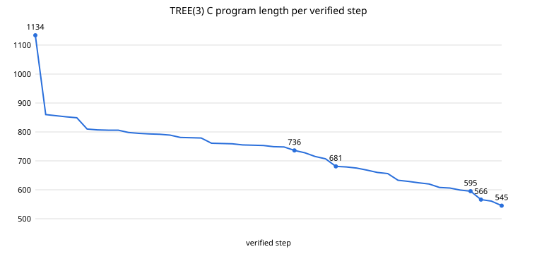

# TREE(3) code golf

[](https://github.com/Zaat/fast-ai/actions/workflows/verify.yml?query=branch%3Atree3-golf)

A reproducible record of an extreme C/Python code-golf experiment for the finite TREE function.

The current C entry is **545 characters** (line breaks not counted), verified by the test harness in this branch. It is the shortest verified C version in this project. **No claim of a formal world record is made without independent comparison against other submissions.**

> TREE(3) is finite, but so enormous that the full computation is not expected to finish in practice. The goal here is to implement the correct search as compactly as possible, not to numerically obtain TREE(3).

## Current C entry

- Source: [`c/tree3.c`](c/tree3.c)
- Explained equivalent: [`c/tree3_explained.c`](c/tree3_explained.c)
- Verified history: [`c/history/`](c/history/)
- Current length: **545 chars**
- Target environment: **gcc, x86-64, permissive GNU C**
- Typical build: `gcc -w c/tree3.c -o tree3`

The golf intentionally relies on old-style/implicit C behavior, GNU/compiler extensions and x86-64 size assumptions. It is **not portable ISO C**.

## What TREE(3) is

TREE(n) is the maximum length of a sequence of finite rooted trees whose nodes use at most `n` colours, where the `k`-th tree has at most `k` nodes and no earlier tree embeds into a later one. Kruskal's tree theorem implies every such bad sequence is finite.

`TREE(1)=1`, `TREE(2)=3`, while `TREE(3)` is unimaginably larger than ordinary large-number constructions used in computation. This program therefore implements the search correctly in principle but is not expected to finish TREE(3) on physical hardware.

## Verification

From `test/`:

```sh
bash T8.sh ../c/tree3.c
```

The harness checks:

1. character count;
2. embedding behavior against 3,000 reference pairs;
3. generator output against an independently produced reference set;
4. TREE(1) = 1 and TREE(2) = 3 under ASan/UBSan;
5. a bounded TREE(3) run to catch immediate sanitizer/runtime failures.

See [`test/README.md`](test/README.md) for details.

## Major C milestones

Selected verified milestones:

```
1513 → 1134 → 860 → 798 → 748 → 736 → 681
     → 629 → 595 → 566 → 561 → 545
```

The complete preserved sequence is in [`c/history/`](c/history/).

Late-stage reductions were mostly **structural**, not cosmetic. Important ideas included:

- flat preorder tree storage;
- subtree **end positions** instead of subtree sizes;
- sign-marking target subtrees instead of a separate used-child array;
- global source/target tree context to remove repeated pointer parameters;
- synthetic empty-tree seeding;
- reverse size-class scans and sentinel generation;
- merging embedding and child-matching logic into one recursive routine;
- exploiting C expression semantics such as chained comparisons to fold control state into existing expressions.

The final 561 → 545 step was found on two systems working in parallel, by different routes: one through a tighter `F`/control-flow encoding with the stop state folded into `n<J>r` (16 chars); the other, whose source is stored as `c/tree3.c`, by dropping `void*realloc();` (15 chars, relying on gcc's built-in `realloc`) plus 1 char from `n<J>r`.

Full verified sequence (chars, line breaks not counted):

```
1513 → 1778 → 824 → 1134 → 860 → 856 → 852 → 849 → 810 → 807 → 806 → 806 → 798 → 795 → 793 → 792
→ 789 → 781 → 780 → 779 → 761 → 760 → 759 → 755 → 754 → 753 → 749 → 748 → 736 → 728 → 715 → 707
→ 681 → 679 → 675 → 668 → 660 → 656 → 633 → 629 → 624 → 620 → 608 → 606 → 599 → 595 → 566 → 561 → 545
```
(1778 is the readable reference used for the assembly version; 824 is the rejected fixed-limit version.)

## Key findings

1. A complete, limit-free TREE(3) search fits in **545 characters** of gcc C (348 in Python).
2. The biggest savings came from **representation changes**, not syntax tricks.
3. A strict **verification harness** was essential: it rejected a dozen plausible-looking shortcuts.
4. Re-verification found a **real memory bug** in an early readable version that had gone unnoticed.
5. **Forecasts of "how much further" were consistently too pessimistic**, by up to a factor of hundreds.
6. Several confident **analyses from other AI systems were wrong** in specific, testable ways.

See [`JOURNAL.md`](JOURNAL.md) for the full story.

## Progress




See [`logs/STATS.md`](logs/STATS.md) for statistics and [`logs/history_results.md`](logs/history_results.md) for the re-verification of every version.

## Milestone commits

| Chars | Commit | Change |
|---:|---|---|
| 1513 | [`9a801a7`](https://github.com/Zaat/fast-ai/commit/9a801a75dede8587379531b874c7d0c6a0d7e64b) | User's original C version |
| 1134 | [`f66511b`](https://github.com/Zaat/fast-ai/commit/f66511b76634b38442537b276843825e71e7c2ee) | No-limits rebuild |
| 860 | [`f5d827e`](https://github.com/Zaat/fast-ai/commit/f5d827e4b671506c6001269c531a51eb84853c54) | New layout and declarations |
| 748 | [`e69495a`](https://github.com/Zaat/fast-ai/commit/e69495a2fca35fa9eb1828c2386c0b7cdb7ce5a8) | Albert: return i/I |
| 681 | [`9e18546`](https://github.com/Zaat/fast-ai/commit/9e185467aa6be445fcff2fb729c908a7384a0f7b) | x and y become globals |
| 633 | [`6fd32a5`](https://github.com/Zaat/fast-ai/commit/6fd32a531a7d76ef1ca97856f8ec269406c8b8a3) | Seed with the empty tree |
| 595 | [`9b17945`](https://github.com/Zaat/fast-ai/commit/9b17945cbb38b3c4ca9d650e434cb5a1a3edd211) | Albert: g(v) parameter, g(d+2) every call |
| 566 | [`f2fd432`](https://github.com/Zaat/fast-ai/commit/f2fd432e48f58a0b84be3d9ac0c8aae006946996) | Merge m and e into one function F |
| 545 | [`a616164`](https://github.com/Zaat/fast-ai/commit/a61616401f4c1d844a6365128ffc4cb2049ba857) | Drop the realloc declaration |

## Repository map

| Path | Purpose |
|---|---|
| [`c/tree3.c`](c/tree3.c) | Current 545-character C entry |
| [`c/tree3_explained.c`](c/tree3_explained.c) | Commented explanation of the current C logic |
| [`c/history/`](c/history/) | Every preserved verified C milestone |
| [`c/tree.s`](c/tree.s) | Assembly generated during the exploration |
| [`python/`](python/) | Python golf history and current Python entry |
| [`test/`](test/) | Verification harness and reference data |
| [`NOTES.md`](NOTES.md) | Technical notes, failed ideas, invariants and breakthroughs |
| [`PROBABILITIES.md`](PROBABILITIES.md) | Forecast history and lessons from repeated probability misses |
| [`JOURNAL.md`](JOURNAL.md) | Chronological story of the project: discussions, findings and conclusions |
| [`c/rejected/`](c/rejected/) | 12 attempts that were tried and rejected, with reasons (`WHY.txt`) |
| [`logs/`](logs/) | Re-verification of every version, rejected-attempt failures, statistics, progress chart |
| [`tools/`](tools/) | Scripts that regenerate everything in `logs/` |
| [`ENVIRONMENT.md`](ENVIRONMENT.md) | Compiler and machine used for the logs |
| [`.github/workflows/verify.yml`](.github/workflows/verify.yml) | GitHub runs the tests on every push |


## Project metadata and participation

- [`CITATION.cff`](CITATION.cff) — citation metadata for this artifact.
- [`CONTRIBUTING.md`](CONTRIBUTING.md) — rules for shorter candidates and verification evidence.
- [`MANIFEST.md`](MANIFEST.md) — content-addressed IDs for the canonical source and core reference data.
- [Shorter-candidate issue template](.github/ISSUE_TEMPLATE/shorter-candidate.yml) — structured submission form for external attempts.
- [GitHub Actions verification](.github/workflows/verify.yml) — re-runs the current harness and the preserved history on pushes/PRs.

## Counting convention

The project record counts **source characters with line breaks excluded** unless otherwise stated. `c/tree3.c` is stored as a 545-byte one-line file.

## Why preserve the history?

The interesting part of this experiment is not only the final number. Multiple versions looked close to irreducible, then a representation-level change removed another large block of source. The history shows the difference between a **local code-golf minimum** and a deeper change in how the algorithm is represented.

The probability estimates made during the search were repeatedly too pessimistic; that history is preserved in [`PROBABILITIES.md`](PROBABILITIES.md) as a record of forecasting failure rather than as a claim of literal lottery-like rarity.

## Status

**Current verified C best in this project: 545 characters.**

Further reductions should be accepted only after they pass the same verification standard as the current entry.
