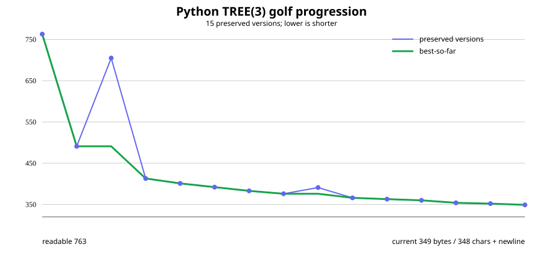

# Python TREE(3) code golf

The Python track is a full part of this project, not merely a side reference to the C version.

## Current Python entry

- Canonical source: [`tree3.py`](tree3.py)
- Historical copy: [`15_349_s348.py`](15_349_s348.py)
- Stored file size: **349 bytes**
- Golf count used during the session: **348 characters + final newline**
- Python environment used for archived verification: **Python 3.13.15**
- Final milestone commit: `dbdd9767e66e8d02cfdd507c11e835146639e470`

`tree3.py` and `15_349_s348.py` are byte-identical in Git.

## Source

```python
from itertools import*
r=0,1,2
a=lambda t:[t+((c,),)for c in r]+[t[:k]+(u,)+t[k+1:]for k in range(1,len(t))for u in a(t[k])]
e=lambda x,y:any(e(x,z)for z in y[1:])or(x[0]==y[0])*any(all(map(e,x[1:],p))for p in permutations(y[1:],len(x)-1))
T=lambda S=[*zip(r)],*q:max([1+T(sum(map(a,S),S),*q,t)for t in S if all(1-e(p,t)for p in q)]+[0])
print(T())
```

TREE(3) itself is not expected to terminate in practice; the source encodes the search.

## Progression

The repository preserves **15 Python versions**, beginning with a 763-byte readable reference and ending at 349 stored bytes.

```
763 → 491 → 413 → 401 → 392 → 383 → 376
    → 366 → 363 → 360 → 354 → 352 → 349
```

Two additional alternate/comparison versions (705 and 391 bytes) are preserved in sequence as well.



See [`STATS.md`](STATS.md) for the full table, compression statistics, and verification notes.

## Major ideas

Python made several parts of the problem extremely compact:

- nested tuples encode rooted coloured trees;
- recursive comprehensions generate one-node extensions;
- recursive `e` implements embedding;
- `itertools.permutations` compactly expresses injective matching between child sets;
- variadic/default arguments encode the bad-sequence search state;
- Python built-ins absorb machinery that the C version must spell out manually.

A late-stage contribution preserved in the milestone commit is:

```python
any(all(map(e,x[1:],p))for p in permutations(y[1:],len(x)-1))
```

Two superficially shorter ideas were explicitly rejected:

- omitting the permutation length changed the result/semantics;
- replacing the fallback form with `max(len(q),*[...])` can crash when the candidate list is empty.

## Verification

The project-wide re-verifier records all numbered Python versions.

The current automated transformation can directly reduce the colour set for the last five versions; each of those currently produces:

```
TREE(2) = 3
```

in about 0.01 seconds in the archived environment.

Earlier versions use different source representations, so the generic script currently records them as **not tested by that transformation** rather than guessing how to rewrite them. This is a limitation of the automation, not a declaration that those files are invalid.

The readable starting source explicitly computes TREE(1) and TREE(2), and Python also served as the high-level conceptual/reference side of the later C verification work.

## Files

| File | Purpose |
|---|---|
| [`01_763_tree_readable.py`](01_763_tree_readable.py) | Readable reference implementation |
| [`02_491_tree_golf.py`](02_491_tree_golf.py) | First major golfed rewrite |
| `03`–`14` | Preserved intermediate/alternate variants |
| [`15_349_s348.py`](15_349_s348.py) | Final historical Python milestone |
| [`tree3.py`](tree3.py) | Canonical current Python entry |
| [`shortest_code.py`](shortest_code.py) | Character-count helper used during exploration |
| [`STATS.md`](STATS.md) | Progression, verification and Python-specific findings |
| [`../logs/python/`](../logs/python/) | Preserved Python verification logs |

## Relationship to the C track

Raw byte counts are not directly comparable across Python and C because Python delegates
allocation, iteration, tuples, permutations, recursion and object management to its runtime.

The two tracks are valuable for different reasons:

- **Python:** extreme compression through high-level language primitives.
- **C:** extreme compression while explicitly implementing much more of the machinery.

Both are part of the history of the project and both should remain preserved.
